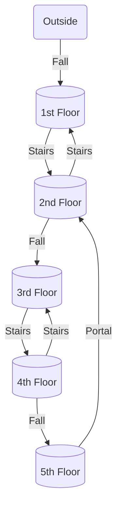
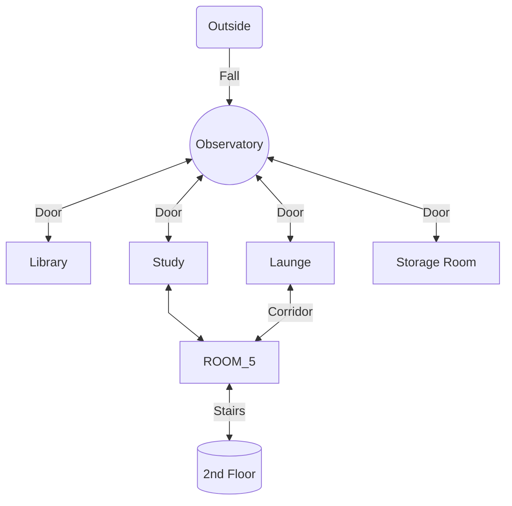
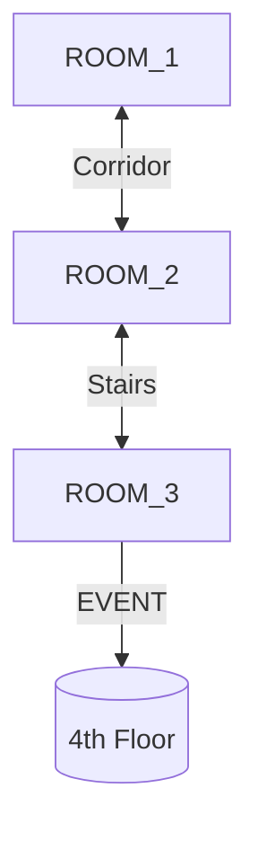
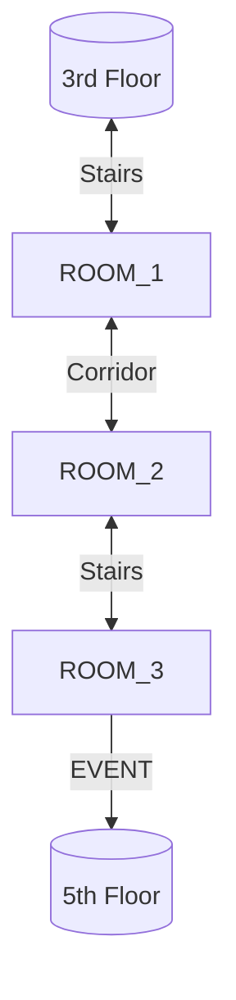
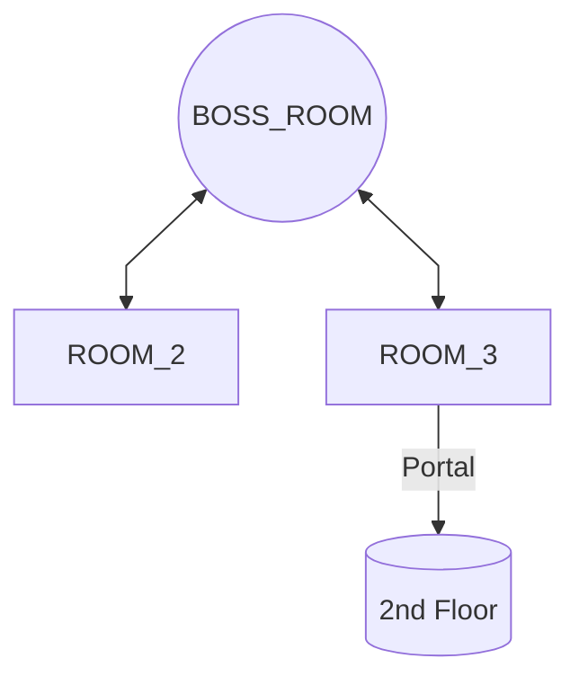

The INVERTED_SPIRE is a gargantuan stone cylinder floating in the Astral Sea without any discernable entrance, except for a small hole in one of its ends.

# History
- Backstory and Adventure Hook:
	- The INVERTED_SPIRE was created by a group of artificers and wizards to study distant stars.
		- The stellar keep was manned by 3 Artificers and 5 Wizards
	- It was placed deep into the Astral Sea by a asteroid ship named DWARVISH_SHIP_NAME for its "maiden voyage" of one year.
	- After the one year the same ship visited the INVERTED_SPIRE and was attacked by its defense systems and retreated back into.
- What Happened to the INVERTED_SPIRE?
	- For the first 6 months of the keep's operations everything was fine
	- One day the keep began to detect a signal from a star.
		- One wizard discovered that the signal was a message. With the message the Artificers discovered that the message was a blueprint for a artifact.
		- The Artificers then built the artifact over the course of a month.
	- When the artifact was completed the star emitted a new signal that ignited the artifact causing it to madden all of the inhabitants of the stellar keep.
	- In a last ditch effort to protect the outside world from the artifact, the least insane Artificer activated the keep's defenses.

The INVERTED_SPIRE one day was a dwarvish stellar keep designed for the porpoise of studding the arcane properties of distant stars. The keep was dragged from orbit of DWARF_HOMEWORLD to the depths of the Astral Sea where it could see the radiance of the farthest stars.

At first it was following according 

Within it the party will find a descending tower with 5 floors as shown on the diagram bellow.

# 1st Floor
The 1st floor is composed of the following rooms, as shown on the  diagram bellow

## Observatory
The atrium is a 30-foot radius 20-foot tall cylindrical room with pillar reinforcements on its walls, a 10-foot radius hole in the middle of the ceiling, and four doorways in the four corners of the room.

On the room's ground there are painted circles and lines, in addition the floor is also scared with shallow markings that seem to have been made with a dagger, with a successful Intelligence (Investigation) check a character can identify that the marking.

> **Clues**
>  Inspecting the lines with a successful Intelligence (Arcana) check a character can surmise that the lines indicate orbits of distant stars.
>  
>  Inspecting the markings on the ground with a successful Intelligence (Investigation) check a character can discern that the markings are written in a strange language *Deep Speech*

 

## Library

## Study

## Lounge

## Storage Room

## ROOM_5

### Encounter
Flanking the doorway to the stairs, that lead down into the 2nd floor, there are two small statues depicting robed dwarves with blue gemstones for eyes. When the party enters within 30 feet of the  statues they animate and start attacking the party. **Roll Initiative!**
 

![[StatueGuardian#Arcane Guardian#Arcane Guardian]]

     

# 2nd Floor
The 2nd floor...

# 3rd Floor

# 4th Floor

# 5th Floor

