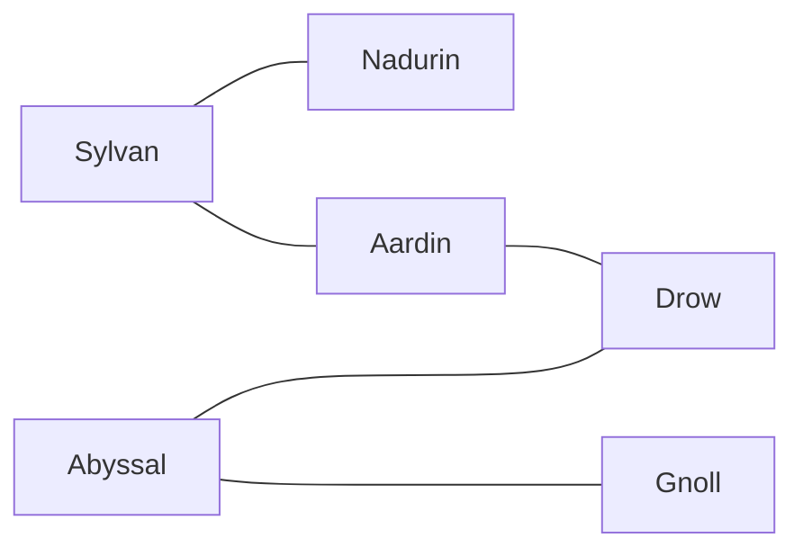

# Languages

## Abyssal
Abyssal, or the language of the darkness, is a deeply gutural language 

The following languages derive from the Abyssal language.

### Drow
Drow derives from a fusion between elvish

### Gnoll
Gnoll...

 

## Sylvan
Sylvan is the ancestral language of the fey...

### Aardin
DESCRIPTION.

### Nadurin
DESCRIPTION.

